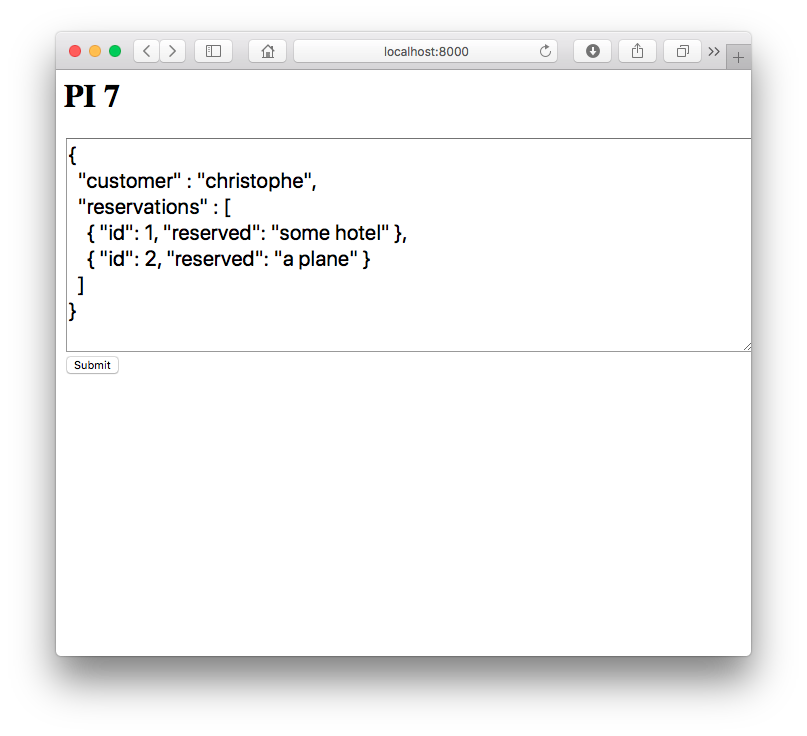
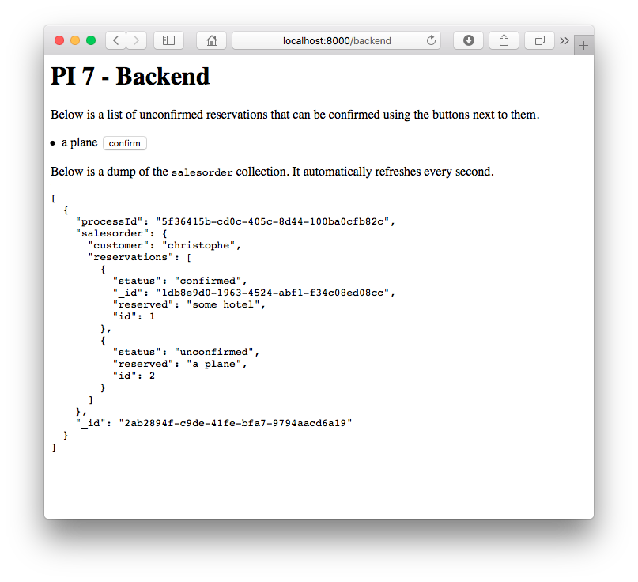
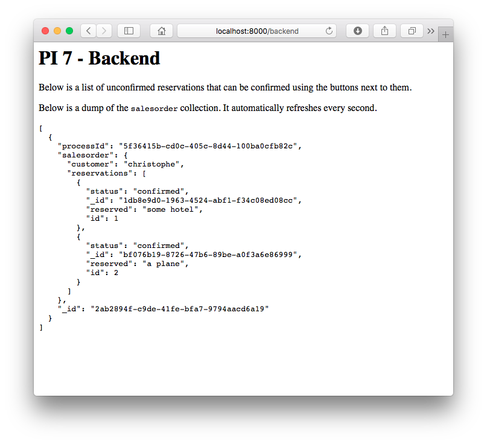

# PI 7

> A 2-hour proof-of-concept of an event-driven order/order-line system, with saga-support for non-sequential event ordering.

## Install && Run

For educational simplicity, all components are hosted within the same application. When run locally, you need to instantiate two workers, to allow the app to talk to itself.

```bash
$ git clone https://github.com/christophevg/pi7
$ cd pi7
$ virtualenv venv
$ . venv/bin/activate
(venv) $ pip install -r requirements.txt
(venv) $ gunicorn --workers=2 pi7:server
```

Alternatively, simply ...

[](https://heroku.com/deploy)

**IMPORTANT**: In case you do so, create an environment variable called `INTEGRATION_URL`, containing the URL of you Heroku deploy, e.g. `https://pi7-demo.herokuapp.com`, if you called your app `pi7-demo`.

## Trigger a Request

Visit [http://localhost:8000](http://localhost:8000)...



...and press "Submit" to simulate the submission of a request to order `some hotel` and `a plane`.

When the request was successfully processed, the browser will be redirected to [http://localhost:8000/backend](http://localhost:8000/backend), which represents the backend application. It gives an overview of requested reservations and shows the content of the `salesorder` collection in the document store...


You can now `confirm` the reservations, and see the updates propagate to the sales order.





Now, feel free to go back to the client-facing part of the application and modify the order, submitting a second request and handle that also ;-) Some inspiration:

```json
{
  "customer" : "koen",
  "reservations" : [
    { "id": 1, "reserved": "some hotel" },
    { "id": 2, "reserved": "a plane" },
    { "id": 3, "reserved": "a bike" }
  ] 
}
```

## Observe Workflow

The logging shows the workflow in action, from the web application receiving the browser request, through the integration layer, dispatching the request to consumers, up to the final confirmation.

```
[2018-11-26 23:05:56 +0100] [21308] [INFO] web: received sales order request
[2018-11-26 23:05:56 +0100] [21308] [INFO]      assigned processId 6b91c191-5923-4374-887d-183ad752d46d
[2018-11-26 23:05:56 +0100] [21308] [INFO]      publishing sales order request event
[2018-11-26 23:05:56 +0100] [21309] [INFO] integration: received sales order request
[2018-11-26 23:05:56 +0100] [21309] [INFO]              delivering to sales order and reservation components
[2018-11-26 23:05:56 +0100] [21308] [INFO] sales order: received sales order request
[2018-11-26 23:05:56 +0100] [21308] [INFO] salesorder: persisted 8b53dc64-f04f-4c8d-bd1e-ce1244cfd8e9
[2018-11-26 23:05:56 +0100] [21308] [INFO] reservation: received sales order request
[2018-11-26 23:05:56 +0100] [21308] [INFO] reservation: making reservation for some hotel
[2018-11-26 23:05:56 +0100] [21308] [INFO] reservation: persisted f97af967-b4a6-4377-accd-15ac3b82f0dc
[2018-11-26 23:05:56 +0100] [21308] [INFO] reservation: persisted f97af967-b4a6-4377-accd-15ac3b82f0dc
[2018-11-26 23:05:56 +0100] [21308] [INFO] reservation: making reservation for a plane
[2018-11-26 23:05:56 +0100] [21308] [INFO] reservation: persisted 60f99f9e-fca2-4db3-b6e8-70bc9daf00e8
[2018-11-26 23:05:56 +0100] [21308] [INFO] reservation: persisted 60f99f9e-fca2-4db3-b6e8-70bc9daf00e8
[2018-11-26 23:05:59 +0100] [21308] [INFO] reservation: loaded f97af967-b4a6-4377-accd-15ac3b82f0dc
[2018-11-26 23:05:59 +0100] [21308] [INFO] reservation: confirming f97af967-b4a6-4377-accd-15ac3b82f0dc
[2018-11-26 23:05:59 +0100] [21308] [INFO] reservation: persisted f97af967-b4a6-4377-accd-15ac3b82f0dc
[2018-11-26 23:05:59 +0100] [21309] [INFO] integration: received reservation confirmation
[2018-11-26 23:05:59 +0100] [21309] [INFO]              delivering to sales order component
[2018-11-26 23:05:59 +0100] [21308] [INFO] sales order: received reservation confirmation
[2018-11-26 23:05:59 +0100] [21308] [INFO] salesorder: loaded context 6b91c191-5923-4374-887d-183ad752d46d
[2018-11-26 23:05:59 +0100] [21308] [INFO] salesorder: persisted 8b53dc64-f04f-4c8d-bd1e-ce1244cfd8e9
[2018-11-26 23:06:01 +0100] [21308] [INFO] reservation: loaded 60f99f9e-fca2-4db3-b6e8-70bc9daf00e8
[2018-11-26 23:06:01 +0100] [21308] [INFO] reservation: confirming 60f99f9e-fca2-4db3-b6e8-70bc9daf00e8
[2018-11-26 23:06:01 +0100] [21308] [INFO] reservation: persisted 60f99f9e-fca2-4db3-b6e8-70bc9daf00e8
[2018-11-26 23:06:01 +0100] [21309] [INFO] integration: received reservation confirmation
[2018-11-26 23:06:01 +0100] [21309] [INFO]              delivering to sales order component
[2018-11-26 23:06:01 +0100] [21308] [INFO] sales order: received reservation confirmation
[2018-11-26 23:06:01 +0100] [21308] [INFO] salesorder: loaded context 6b91c191-5923-4374-887d-183ad752d46d
[2018-11-26 23:06:01 +0100] [21308] [INFO] salesorder: persisted 8b53dc64-f04f-4c8d-bd1e-ce1244cfd8e9
[2018-11-26 23:06:01 +0100] [21308] [INFO] salesorder: all reservations are confirmed
[2018-11-26 23:06:01 +0100] [21309] [INFO] integration: received sales order confirmation
```

## Meanwhile in the Store

```bash
$ mongo
> use pi7
> db.salesorder.find().pretty()
{
	"_id" : "8b53dc64-f04f-4c8d-bd1e-ce1244cfd8e9",
	"processId" : "6b91c191-5923-4374-887d-183ad752d46d",
	"object" : {
		"customer" : "christophe",
		"reservations" : [
			{
				"status" : "confirmed",
				"_id" : "f97af967-b4a6-4377-accd-15ac3b82f0dc",
				"reserved" : "some hotel",
				"id" : 1
			},
			{
				"status" : "confirmed",
				"_id" : "60f99f9e-fca2-4db3-b6e8-70bc9daf00e8",
				"reserved" : "a plane",
				"id" : 2
			}
		]
	}
}
> db.reservation.find().pretty()
{
	"_id" : "f97af967-b4a6-4377-accd-15ac3b82f0dc",
	"processId" : "6b91c191-5923-4374-887d-183ad752d46d",
	"object" : {
		"status" : "confirmed",
		"reserved" : "some hotel",
		"id" : 1,
		"history" : [
			{
				"status" : "unconfirmed",
				"time" : 1543269956
			},
			{
				"status" : "confirmed",
				"time" : 1543269959
			}
		]
	}
}
{
	"_id" : "60f99f9e-fca2-4db3-b6e8-70bc9daf00e8",
	"processId" : "6b91c191-5923-4374-887d-183ad752d46d",
	"object" : {
		"status" : "confirmed",
		"reserved" : "a plane",
		"id" : 2,
		"history" : [
			{
				"status" : "unconfirmed",
				"time" : 1543269956
			},
			{
				"status" : "confirmed",
				"time" : 1543269961
			}
		]
	}
}
```
