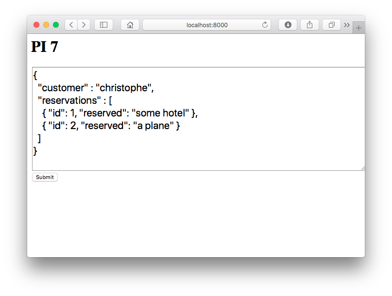
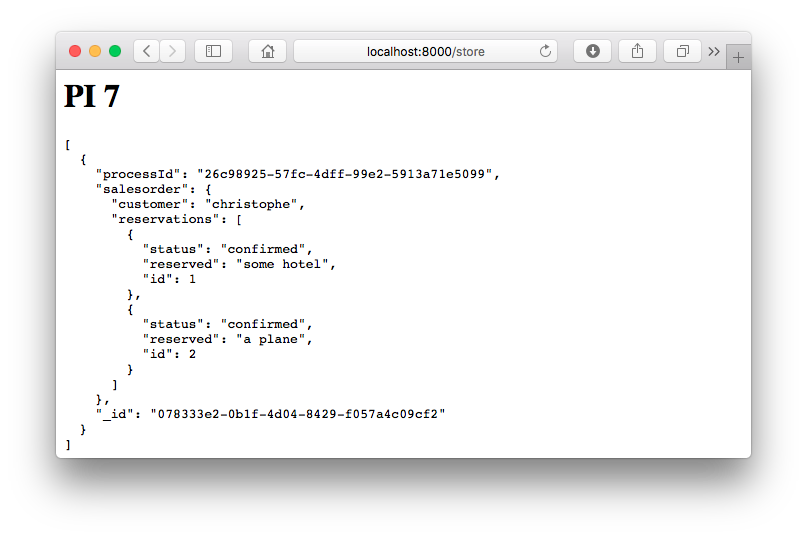

# PI 7

> A 2-hour proof-of-concept of an event-driven order/order-line system, with saga-support for non-sequential event ordering.

## Install && Run

For educational simplicity, all components are hosted within the same application. All communication is done synchronously, again for educational simplicity. So 6 workers are required.

```bash
$ git clone https://github.com/christophevg/pi7
$ cd pi7
$ virtualenv venv
$ . venv/bin/activate
(venv) $ pip install -r requirements.txt
(venv) $ gunicorn --workers=6 pi7:server
```

Alternatively, simply ...

[](https://heroku.com/deploy)

**IMPORTANT**: In case you do so, create an environment variable called `INTEGRATION_URL`, containing the URL of you Heroku deploy, e.g. `https://pi7-demo.herokuapp.com`, if you called your app `pi7-demo`.

## Trigger a Request

Visit [http://localhost:8000](http://localhost:8000)...



...and press "Submit". When the request was successfully processed, the browser will be redirected to [http://localhost:8000/store](http://localhost:8000/store), which will show the content of the `salesorder` collection in the document store...



## Observe Workflow

The logging shows the workflow in action, from the web application receiving the browser request, through the integration layer, dispatching the request to consumers, up to the final confirmation.

```
[2018-11-23 23:06:43 +0100] [99835] [INFO] web: received sales order request
[2018-11-23 23:06:43 +0100] [99835] [INFO]      assigned businessProcessId 2c9d47b8-e33f-488a-85f1-38f1b327f0b8
[2018-11-23 23:06:43 +0100] [99835] [INFO]      publishing sales order request event
[2018-11-23 23:06:43 +0100] [99833] [INFO] integration: received sales order request
[2018-11-23 23:06:43 +0100] [99833] [INFO]              delivering to sales order and reservation components
[2018-11-23 23:06:43 +0100] [99834] [INFO] sales order: received sales order request
[2018-11-23 23:06:43 +0100] [99834] [INFO] sales order: persisted 9d250d92-5eab-451e-930b-ddf4a7bbfd11
[2018-11-23 23:06:43 +0100] [99832] [INFO] reservation: received sales order request
[2018-11-23 23:06:43 +0100] [99832] [INFO] reservation: making reservation for some hotel
[2018-11-23 23:06:44 +0100] [99832] [INFO] reservation: persisted 439396fa-43f1-41f3-8196-c66abe08a892
[2018-11-23 23:06:44 +0100] [99832] [INFO] reservation: confirming
[2018-11-23 23:06:44 +0100] [99832] [INFO] reservation: persisted 439396fa-43f1-41f3-8196-c66abe08a892
[2018-11-23 23:06:44 +0100] [99834] [INFO] integration: received reservation confirmation
[2018-11-23 23:06:44 +0100] [99834] [INFO]              delivering to sales order component
[2018-11-23 23:06:44 +0100] [99836] [INFO] sales order: received reservation confirmation
[2018-11-23 23:06:44 +0100] [99836] [INFO] sales order: persisted 9d250d92-5eab-451e-930b-ddf4a7bbfd11
[2018-11-23 23:06:44 +0100] [99832] [INFO] reservation: making reservation for a plane
[2018-11-23 23:06:45 +0100] [99832] [INFO] reservation: persisted a59629a0-2c5f-43b6-b10d-b1d70fae043d
[2018-11-23 23:06:45 +0100] [99832] [INFO] reservation: confirming
[2018-11-23 23:06:45 +0100] [99832] [INFO] reservation: persisted a59629a0-2c5f-43b6-b10d-b1d70fae043d
[2018-11-23 23:06:45 +0100] [99836] [INFO] integration: received reservation confirmation
[2018-11-23 23:06:45 +0100] [99836] [INFO]              delivering to sales order component
[2018-11-23 23:06:45 +0100] [99834] [INFO] sales order: received reservation confirmation
[2018-11-23 23:06:45 +0100] [99834] [INFO] sales order: persisted 9d250d92-5eab-451e-930b-ddf4a7bbfd11
[2018-11-23 23:06:45 +0100] [99834] [INFO] sales order: all reservations are confirmed
[2018-11-23 23:06:45 +0100] [99831] [INFO] integration: received sales order confirmation
```

## Meanwhile in the Store

```bash
$ mongo
> use pi7
> db.salesorder.find().pretty()
{
	"_id" : "9d250d92-5eab-451e-930b-ddf4a7bbfd11",
	"processId" : "2c9d47b8-e33f-488a-85f1-38f1b327f0b8",
	"salesorder" : {
		"customer" : "christophe",
		"reservations" : [
			{
				"status" : "confirmed",
				"_id" : "439396fa-43f1-41f3-8196-c66abe08a892",
				"reserved" : "some hotel",
				"id" : 1
			},
			{
				"status" : "confirmed",
				"_id" : "a59629a0-2c5f-43b6-b10d-b1d70fae043d",
				"reserved" : "a plane",
				"id" : 2
			}
		]
	}
}
> db.reservation.find().pretty()
{
	"_id" : "439396fa-43f1-41f3-8196-c66abe08a892",
	"processId" : "2c9d47b8-e33f-488a-85f1-38f1b327f0b8",
	"reservation" : {
		"status" : "confirmed",
		"reserved" : "some hotel",
		"id" : 1
	}
}
{
	"_id" : "a59629a0-2c5f-43b6-b10d-b1d70fae043d",
	"processId" : "2c9d47b8-e33f-488a-85f1-38f1b327f0b8",
	"reservation" : {
		"status" : "confirmed",
		"reserved" : "a plane",
		"id" : 2
	}
}
```
