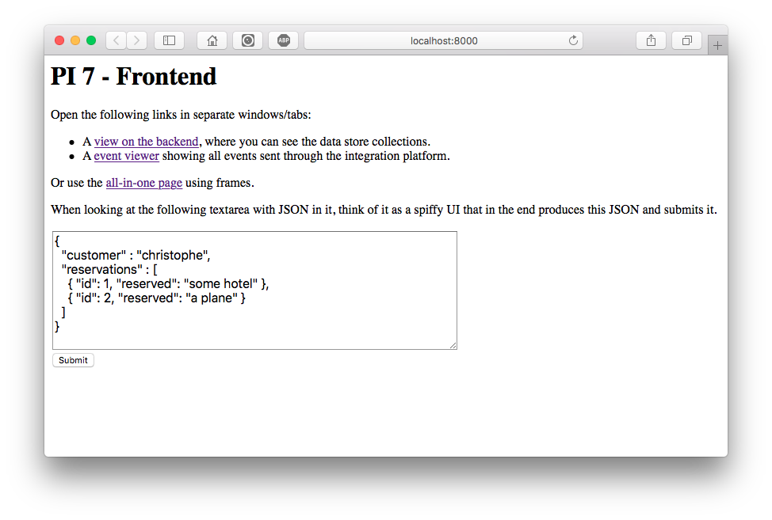
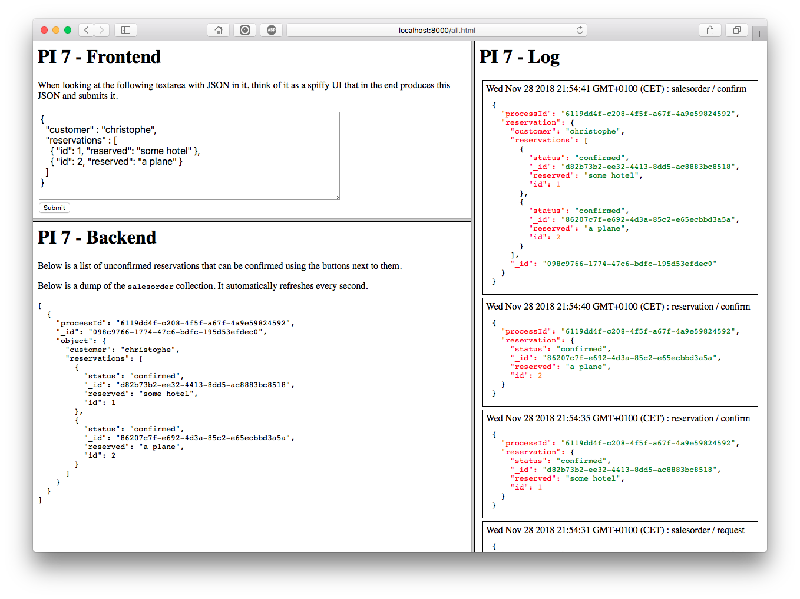

# PI 7

> A 2-hour proof-of-concept of an event-driven order/order-line system, with saga-support for non-sequential event ordering.

## Install && Run

For educational simplicity, all components are hosted within the same application.

```bash
$ git clone https://github.com/christophevg/pi7
$ cd pi7
$ virtualenv venv
$ . venv/bin/activate
(venv) $ pip install -r requirements.txt
(venv) $ gunicorn pi7:server
```

Alternatively, simply ...

[](https://heroku.com/deploy)

**IMPORTANT**: In case you do so, create an environment variable called `INTEGRATION_URL`, containing the URL of you Heroku deploy, e.g. `https://pi7-demo.herokuapp.com`, if you called your app `pi7-demo`.

## Trigger a Request

Visit [http://localhost:8000](http://localhost:8000)...



...and open two more windows or tabs, or use the framed all-in-one view:


Now press "Submit" to simulate the submission of a request to order `some hotel` and `a plane`.

At the bottom, the backend application gives an overview of requested reservations and shows the content of the `salesorder` collection in the document store. 

On the right, the log view shows the events that are passed over the integration platform, here implemented using a topic-based message queue.

After submitting the request, the backend shows two reservations to be confirmed and a sales order with two unconfirmed reservations:


You can now `confirm` the reservations, and see the updates propagate to the sales order.




In the log viewer, we also see an event, raised by the sales order to indicate it has been confirmed, due to all of its reservations being confirmed.

Now, feel free to go back to the client-facing part of the application and modify the order, submitting a second request and handle that also ;-) Some inspiration:

```json
{
  "customer" : "koen",
  "reservations" : [
    { "id": 1, "reserved": "some hotel" },
    { "id": 2, "reserved": "a plane" },
    { "id": 3, "reserved": "a bike" }
  ] 
}
```

## Observe Workflow

The logging shows the workflow in action, from the web application receiving the browser request, through the integration layer, dispatching the request to consumers, up to the final confirmation.

```
[2018-11-28 21:54:31 +0100] [34437] [INFO] web: received sales order request
[2018-11-28 21:54:31 +0100] [34437] [INFO]      assigned processId 6119dd4f-c208-4f5f-a67f-4a9e59824592
[2018-11-28 21:54:31 +0100] [34437] [INFO]      publishing sales order request event
[2018-11-28 21:54:31 +0100] [34437] [INFO] reservation: received sales order request
[2018-11-28 21:54:31 +0100] [34437] [INFO] reservation: making reservation for some hotel
[2018-11-28 21:54:31 +0100] [34437] [INFO] reservation: persisted d82b73b2-ee32-4413-8dd5-ac8883bc8518
[2018-11-28 21:54:31 +0100] [34437] [INFO] reservation: making reservation for a plane
[2018-11-28 21:54:31 +0100] [34437] [INFO] reservation: persisted 86207c7f-e692-4d3a-85c2-e65ecbbd3a5a
[2018-11-28 21:54:31 +0100] [34437] [INFO] sales order: received sales order request
[2018-11-28 21:54:31 +0100] [34437] [INFO] salesorder: persisted 098c9766-1774-47c6-bdfc-195d53efdec0
[2018-11-28 21:54:35 +0100] [34437] [INFO] reservation: loaded d82b73b2-ee32-4413-8dd5-ac8883bc8518
[2018-11-28 21:54:35 +0100] [34437] [INFO] reservation: confirming d82b73b2-ee32-4413-8dd5-ac8883bc8518
[2018-11-28 21:54:35 +0100] [34437] [INFO] reservation: persisted d82b73b2-ee32-4413-8dd5-ac8883bc8518
[2018-11-28 21:54:35 +0100] [34437] [INFO] salesorder: received reservation confirmation
[2018-11-28 21:54:35 +0100] [34437] [INFO] salesorder: loaded context 6119dd4f-c208-4f5f-a67f-4a9e59824592
[2018-11-28 21:54:35 +0100] [34437] [INFO] salesorder: persisted 098c9766-1774-47c6-bdfc-195d53efdec0
[2018-11-28 21:54:40 +0100] [34437] [INFO] reservation: loaded 86207c7f-e692-4d3a-85c2-e65ecbbd3a5a
[2018-11-28 21:54:40 +0100] [34437] [INFO] reservation: confirming 86207c7f-e692-4d3a-85c2-e65ecbbd3a5a
[2018-11-28 21:54:40 +0100] [34437] [INFO] reservation: persisted 86207c7f-e692-4d3a-85c2-e65ecbbd3a5a
[2018-11-28 21:54:40 +0100] [34437] [INFO] salesorder: received reservation confirmation
[2018-11-28 21:54:41 +0100] [34437] [INFO] salesorder: loaded context 6119dd4f-c208-4f5f-a67f-4a9e59824592
[2018-11-28 21:54:41 +0100] [34437] [INFO] salesorder: persisted 098c9766-1774-47c6-bdfc-195d53efdec0
[2018-11-28 21:54:41 +0100] [34437] [INFO] salesorder: all reservations are confirmed
```

## Meanwhile in the Store

```bash
$ mongo
> use pi7
> db.salesorder.find().pretty()
{
	"_id" : "098c9766-1774-47c6-bdfc-195d53efdec0",
	"processId" : "6119dd4f-c208-4f5f-a67f-4a9e59824592",
	"object" : {
		"customer" : "christophe",
		"reservations" : [
			{
				"status" : "confirmed",
				"_id" : "d82b73b2-ee32-4413-8dd5-ac8883bc8518",
				"reserved" : "some hotel",
				"id" : 1
			},
			{
				"status" : "confirmed",
				"_id" : "86207c7f-e692-4d3a-85c2-e65ecbbd3a5a",
				"reserved" : "a plane",
				"id" : 2
			}
		]
	}
}
> db.reservation.find().pretty()
{
	"_id" : "d82b73b2-ee32-4413-8dd5-ac8883bc8518",
	"processId" : "6119dd4f-c208-4f5f-a67f-4a9e59824592",
	"object" : {
		"status" : "confirmed",
		"reserved" : "some hotel",
		"id" : 1,
		"history" : [
			{
				"status" : "unconfirmed",
				"time" : 1543438471
			},
			{
				"status" : "confirmed",
				"time" : 1543438475
			}
		]
	}
}
{
	"_id" : "86207c7f-e692-4d3a-85c2-e65ecbbd3a5a",
	"processId" : "6119dd4f-c208-4f5f-a67f-4a9e59824592",
	"object" : {
		"status" : "confirmed",
		"reserved" : "a plane",
		"id" : 2,
		"history" : [
			{
				"status" : "unconfirmed",
				"time" : 1543438471
			},
			{
				"status" : "confirmed",
				"time" : 1543438480
			}
		]
	}
}
```
